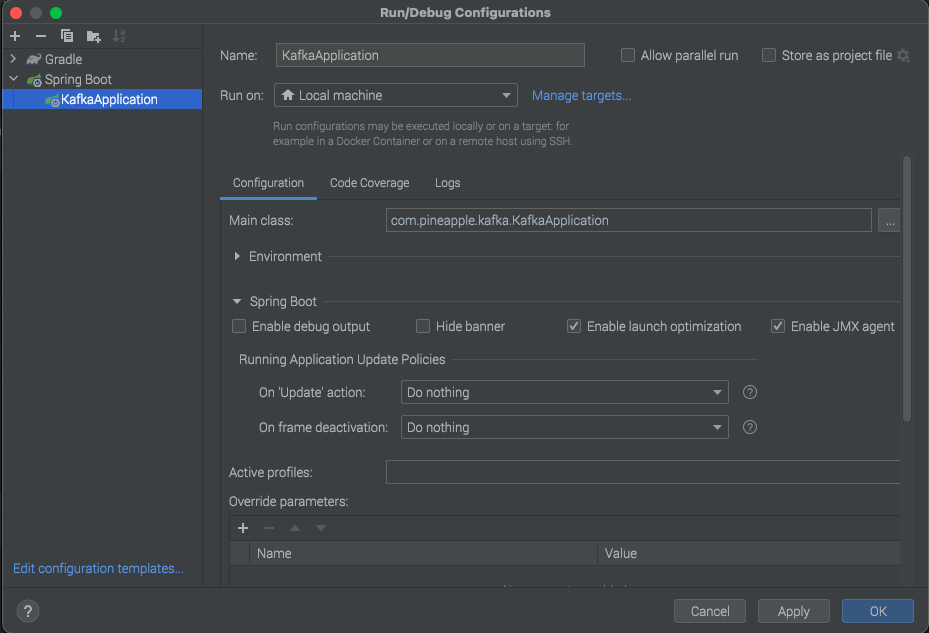

### Run locally

To run kafka from docker execute these
* ```make compose-up```

To run a specific server, example:
* ``` make compose-up-service SERVICE="broker"```

To exec bash into a container/service, example:
* ``` make compose-exec-service SERVICE="broker"```

### Configuration in IDEA locally

The image below is illustrative only and is an example with intelliJ.

